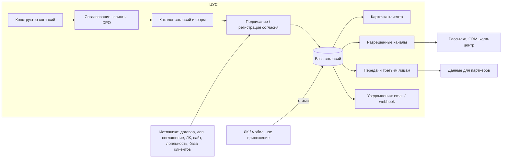

# Техническое задание: «Центр управления согласиями» (ЦУС)

Серверное приложение на Java для учёта согласий субъектов персональных данных (ПДн).
Документ написан как рабочее ТЗ для разработки с помощью Claude Code.

Версия 1.2 от 17.08.2026. Источник продуктовых требований — презентация «Центр управления согласиями» (HFLabs); нормативная база — 152-ФЗ «О персональных данных» и 38-ФЗ «О рекламе».

---

## Постановка задачи для Claude Code

Исполнитель — Claude Code. Задача: разработать с нуля серверное приложение «Центр управления согласиями» на Java по требованиям этого документа и довести его до состояния готового к передаче в эксплуатацию продукта, а не прототипа. Готового кода нет; репозиторий создаётся с пустой директории.

Результат работ, который должен быть получен:

1. Репозиторий со структурой §12, собирающийся командой `./mvnw verify` без ошибок тестов, покрытия и линтеров.
2. Реализованы все функциональные требования FR-1.1 … FR-12.2, веб-интерфейс по спецификации §16 и нефункциональные требования NFR-1 … NFR-8.
3. Система поднимается командой `docker compose up` и проходит `scripts/demo.sh` — сквозной сценарий из §11 (форма → согласование → регистрация согласия → карточка → канал разрешён → отзыв → канал запрещён → webhook и письмо).
4. Тесты по §11 с порогом покрытия; `docs/openapi.yaml` соответствует коду; документация по NFR-7.
5. Заполненные `docs/DECISIONS.md` (принятые решения) и `docs/OPEN_QUESTIONS.md` (вопросы заказчику).

Порядок выполнения: этапы 0–8 из §13 строго последовательно, каждый — до выполнения его критериев готовности, после каждого — краткий отчёт (п. 12 §14) и ожидание подтверждения перед следующим этапом. Запрещено: менять стек §4, пропускать или отключать тесты, сокращать объём «для MVP» без записи в `docs/OPEN_QUESTIONS.md`, реализовывать опциональное раньше обязательного.

Стартовое сообщение для Claude Code (положить ТЗ в `docs/TZ.md`, создать `CLAUDE.md` по Приложению F и отправить):

```text
Прочитай docs/TZ.md целиком. Ты исполнитель: тебе нужно с нуля разработать «Центр управления согласиями» на Java по этому ТЗ. Начни с этапа 0 (§13): создай каркас проекта в текущей директории, соблюдая стек §4 и правила §14. По завершении этапа прогони ./mvnw verify, покажи результат и отчитайся по форме из п. 12 §14. К следующему этапу переходи только после моего подтверждения.
```

## 0. Как работать с этим документом

- Разместить файл как `docs/TZ.md`. В корне репозитория держать `CLAUDE.md` с короткой выжимкой (стек, команды сборки, правила из §14) и ссылкой на этот файл — шаблон в Приложении F.
- Разработка ведётся строго по этапам §13. Этап считается закрытым только при выполнении всех его критериев готовности.
- Требования пронумерованы (FR-x.y — функциональные, NFR-x — нефункциональные). В коммитах, тестах и ADR ссылаться на номера.
- Всё, чего в документе нет, не додумывать: записать вопрос в `docs/OPEN_QUESTIONS.md`, принять простейшее обратимое решение и зафиксировать его в `docs/DECISIONS.md` (формат ADR: контекст → решение → последствия).

## 1. Назначение и цели

ЦУС — внутренняя система оператора ПДн, которая наводит порядок в клиентских согласиях. Она собирает согласия из всех точек контакта с клиентом (договор, доп. соглашение, регистрация в личном кабинете, заявка на сайте, программа лояльности, историческая база клиентов) в единую базу, ведёт структурированный каталог типов и форм согласий, по каждому клиенту показывает актуальную картину (что действует, что отозвано, что скоро закончится), подсказывает разрешённые каналы коммуникации, легализует передачу данных партнёрам и внутри экосистемы, даёт клиенту возможность самостоятельно отозвать согласие и заранее оповещает ответственных о необходимости переподписания.

Цели первой очереди:

1. Соответствие 152-ФЗ: согласие конкретное, предметное, информированное, сознательное и однозначное (ст. 9); обязанность оператора доказать наличие согласия (ч. 3 ст. 9); обязательные реквизиты письменного согласия (ч. 4 ст. 9); отдельное согласие на распространение (ст. 10.1); прекращение обработки при отзыве (ч. 5 ст. 21); локализация баз данных в РФ (ч. 5 ст. 18).
2. Соответствие 38-ФЗ: реклама по сетям электросвязи только при предварительном согласии адресата и немедленное прекращение по его требованию (ст. 18).
3. Единая точка правды по согласиям для CRM, систем рассылок, колл-центра и партнёрских выгрузок: ответ «можно / нельзя» по каналу и по передаче за миллисекунды.
4. Доказуемость: по любому согласию восстанавливается, кто, когда, из какого источника, на какой точный текст формы и на каких условиях дал согласие или отозвал его.

Юридический аудит текстов согласий и политики обработки ПДн (в исходном продукте — услуга партнёров) в объём разработки не входит; система обеспечивает workflow согласования и контроль обязательных реквизитов, но не заменяет юриста.

## 2. Термины

| Термин | Значение |
|---|---|
| Субъект ПДн, клиент | Физическое лицо, чьи данные обрабатывает оператор. |
| Оператор | Организация, эксплуатирующая ЦУС. Реквизиты хранятся в настройках. |
| Тип согласия | Бизнес-значимый вид разрешения: обработка ПДн, реклама по телефону, реклама по email, передача ПДн третьему лицу и т. п. Справочник. |
| Форма согласия | Версионируемый текст документа с одним или несколькими пунктами; каждый пункт привязан к типу согласия. Проходит согласование юристами и DPO. |
| Согласие (экземпляр) | Факт выражения воли субъектом по конкретному пункту конкретной версии формы, с доказательствами, источником и сроком действия. |
| Эффективное согласие | Последнее по времени согласие субъекта данного типа (и данного третьего лица для передач). Только оно учитывается при расчёте каналов и передач. |
| Источник | Точка контакта, где получено согласие: база клиентов (импорт), договор, доп. соглашение, регистрация в ЛК, заявка на сайте, программа лояльности, мобильное приложение, колл-центр, офис. |
| Канал коммуникации | Телефонный звонок, SMS, email, push, мессенджер, почтовая рассылка. |
| Третье лицо (партнёр) | Организация, которой оператор передаёт ПДн: обработчик по поручению, самостоятельный получатель или компания экосистемы. |
| Отзыв | Прекращение действия согласия по воле субъекта. Необратим. |
| Переподписание | Получение нового согласия взамен истекающего или истёкшего. |
| DPO | Ответственный за организацию обработки ПДн. |
| Карточка клиента | Сводное представление всех согласий субъекта со статусами, разрешёнными каналами и передачами. |

## 3. Границы работ

В объёме: серверное приложение на Java с REST API и OpenAPI-описанием; схема БД и миграции; фоновые задачи (статусы, уведомления, доставка событий); импорт и экспорт; webhooks и email; встроенная аутентификация и RBAC; self-service API для личного кабинета и мобильного приложения; веб-интерфейс сотрудника и встраиваемая страница самообслуживания клиента по спецификации §16 (этап 7); демо-данные; Docker-сборка; документация. Если заказчик выберет внешний фронтенд (открытый вопрос 9), §16 остаётся спецификацией экранов для него, а этап 7 сокращается до страницы самообслуживания.

Вне объёма: CRM и системы рассылок как таковые (ЦУС отвечает «можно / нельзя» и отдаёт списки, но сам не рассылает); квалифицированная электронная подпись (предусмотреть интерфейс `SignatureProvider` и реализацию-заглушку); хранилище сканов документов (хранятся ссылки и метаданные; интерфейс `DocumentStorage`, реализация на локальной ФС для dev); юридический аудит; сами ЛК и мобильное приложение (ЦУС предоставляет им API).

## 4. Технологический стек (обязательный)

| Область | Решение |
|---|---|
| Язык | Java 21 LTS, без preview-фич. Сборка и запуск на OpenJDK-совместимых дистрибутивах (Axiom JDK, Liberica). |
| Сборка | Maven 3.9+ с wrapper (`./mvnw`). Один Maven-модуль (модульный монолит), разбиение на модули по пакетам, см. §5. |
| Фреймворк | Spring Boot 3.3+: Web MVC, Validation, Data JPA (Hibernate 6), Security, Mail, Scheduling, Actuator. |
| БД | PostgreSQL 16. Использовать только SQL, совместимый с Postgres Pro; из расширений — не более `pgcrypto`. UUID генерируются в приложении. Миграции — Flyway, чистый SQL в `src/main/resources/db/migration`, `spring.jpa.hibernate.ddl-auto=validate`. |
| Маппинг, DTO | MapStruct; Java records для DTO; Lombok допускается. |
| API | REST, JSON, префикс `/api/v1`. springdoc-openapi, спецификация экспортируется при сборке в `docs/openapi.yaml` и коммитится. Ошибки в формате RFC 9457 `ProblemDetail`. |
| Планировщик | Spring `@Scheduled` + ShedLock (таблица в PostgreSQL) для безопасной работы нескольких экземпляров. |
| Доставка событий | Transactional Outbox (таблица `outbox_event`) и доставка webhooks с ретраями. Kafka — только опциональный профиль `kafka` на Spring Kafka, для MVP не требуется. |
| Тесты | JUnit 5, AssertJ, Mockito, Spring Boot Test, Testcontainers (PostgreSQL, Mailpit), ArchUnit, MockMvc или REST-assured, JaCoCo. |
| Наблюдаемость | Actuator (`/actuator/health`, `/actuator/prometheus`), Micrometer, JSON-логи (logback), correlation id в заголовке `X-Request-Id`. |
| Контейнеры | Многостадийный Dockerfile; `docker-compose.yml`: app, postgres, mailpit. Приложение должно запускаться на Alt Linux с OpenJDK и PostgreSQL / Postgres Pro. |
| Качество кода | Spotless (palantir-java-format), Checkstyle (базовый набор), проверка зависимостей (OWASP dependency-check или trivy) в CI. |
| Импортозамещение | Никаких обязательных зависимостей от зарубежных облачных сервисов; все компоненты — open source с лицензиями Apache 2.0 / MIT / BSD / EPL. |

## 5. Архитектура

Модульный монолит, один деплой-юнит. Корневой пакет `ru.example.cus` (заменить `example` на домен оператора). Модули:

| Пакет | Ответственность |
|---|---|
| `catalog` | Типы согласий, формы, версии, workflow согласования (конструктор + согласование + каталог). |
| `registry` | Субъекты, экземпляры согласий, статусы, карточка клиента, отзыв. |
| `thirdparty` | Справочник третьих лиц, правила передачи, выгрузки партнёрам. |
| `channels` | Расчёт разрешённых каналов коммуникации, массовые проверки. |
| `notification` | Правила и отправка уведомлений (email, webhooks), outbox, доставка. |
| `integration` | Импорт из источников, экспорт, webhook-подписки, self-service API для ЛК и мобильного приложения. |
| `audit` | Неизменяемый журнал событий с хеш-цепочкой, журнал доступа к ПДн. |
| `iam` | Пользователи, роли, аутентификация. |
| `ui` | Веб-интерфейс сотрудника и страница самообслуживания клиента: Thymeleaf-контроллеры, шаблоны, статические ассеты. Использует application-сервисы других модулей напрямую. |
| `common` | Общие value objects, обработка ошибок, конфигурация, утилиты времени и хеширования. |

Слои внутри каждого модуля: `api` (контроллеры, DTO), `application` (сценарии, транзакции), `domain` (сущности, value objects, доменные правила и события), `infrastructure` (JPA-репозитории, порта, HTTP-клиенты). Правила: `domain` не зависит от `api` и `infrastructure`; модули общаются только через application-сервисы и Spring `ApplicationEvent`; прямой доступ к репозиториям чужого модуля запрещён. Правила закреплены тестами ArchUnit.

Поток данных, соответствующий схеме продукта:



## 6. Модель данных

Общие правила: первичные ключи — UUID; все временные метки — `timestamptz` (в БД UTC, отображение и календарные расчёты — в таймзоне оператора, по умолчанию `Europe/Moscow`); у изменяемых сущностей поля `created_at, created_by, updated_at, updated_by, version` (оптимистичная блокировка). Справочники не удаляются, а деактивируются (`is_active`); экземпляры согласий, журналы аудита и доступа не удаляются и не редактируются никогда.

| Таблица | Ключевые поля | Примечания |
|---|---|---|
| `subject` | id, external_id (unique — ID в мастер-системе), last_name, first_name, middle_name, birth_date? | ЦУС не мастер-система по клиентам: хранится минимально необходимый состав. |
| `subject_contact` | subject_id, type (PHONE, EMAIL, POSTAL_ADDRESS), value, value_normalized (E.164 / lowercase), is_primary, valid_from, valid_to | Индекс по (type, value_normalized), уникальности между субъектами нет. |
| `consent_type` | code (unique, неизменяем), name_ru, description, category, channels[] (какие каналы открывает), requires_third_party, default_validity (ISO-8601 duration, null = до отзыва), depends_on_type_id (каскадный отзыв), business_significant, is_active, sort_order | Seed — Приложение B. |
| `pdn_category` | code, name_ru, is_special, is_biometric | Справочник категорий ПДн: FIO, PHONE, EMAIL, POSTAL_ADDRESS, BIRTH_DATE, PASSPORT и т. д. |
| `third_party` | id, name, short_name, inn, ogrn, address, role (PROCESSOR, RECIPIENT, ECOSYSTEM), contract_number, contract_date, contract_valid_until, allowed_pdn_categories[], contact_email, is_active | Справочник третьих лиц. |
| `consent_form` | id, code, version (unique вместе с code), title, status, body (Markdown/HTML с плейсхолдерами `{{operator.name}}`, `{{subject.fio}}` …), processing_actions, revocation_procedure, source_channels[], valid_from, valid_to, rendered_checksum, published_at, previous_version_id | Опубликованная версия неизменяема; checksum — SHA-256 канонического рендера без данных субъекта. |
| `consent_form_item` | id, form_id, consent_type_id, sort_order, text, purposes[], pdn_categories[], third_party_id?, validity?, is_mandatory | Поля «предотмеченный чекбокс» нет — согласие только активным действием. |
| `form_approval` | form_id, role_required (LAWYER, DPO), user_id, decision (APPROVED, REJECTED), comment, decided_at | История согласования. |
| `consent` | id, subject_id, consent_type_id, form_id, form_item_id, form_checksum, source, source_ref, status, granted_at, valid_until?, revoked_at?, revocation_reason?, revocation_source?, third_party_id?, pdn_categories[] (snapshot), purposes[] (snapshot), evidence (jsonb), superseded_by_id?, idempotency_key (unique) | Индексы: (subject_id, consent_type_id, status), (valid_until) where status in (ACTIVE, EXPIRING), (third_party_id, status). |
| `audit_event` | id (bigserial), aggregate_type, aggregate_id, subject_id?, event_type, occurred_at, actor_type, actor_id, payload (jsonb), prev_hash, hash | Append-only. Хеш-цепочка по агрегату: hash = SHA-256(prev_hash + канонический payload). |
| `audit_anchor` | day, events_count, day_hash, created_at | Ежедневный «якорь» — хеш всех событий дня, для внешней фиксации. |
| `pdn_access_log` | id, user_id, endpoint, subject_id?, subjects_count, request_id, occurred_at | Append-only журнал доступа к ПДн. |
| `notification_rule` | id, name, trigger (EXPIRING, EXPIRED, REVOKED, GRANTED, THIRD_PARTY_CONTRACT_EXPIRING), days_before[], consent_type_id?, third_party_id?, recipient_emails[], recipient_roles[], channels (EMAIL, WEBHOOK), is_active | Пороги по умолчанию {30, 15, 7, 1}. |
| `notification` | id, rule_id, consent_id?, subject_id?, dedupe_key (unique), channel, recipient, status (PENDING, SENT, FAILED), attempts, last_error, created_at, sent_at | Дедупликация: один порог по одному согласию — одно уведомление. |
| `webhook_subscription` | id, name, url, secret (шифруется в БД), event_types[], headers (jsonb), is_active | HMAC-подпись доставок. |
| `outbox_event` | id, aggregate_type, aggregate_id, event_type, payload, created_at, status, attempts, next_attempt_at, processed_at | Transactional Outbox. |
| `webhook_delivery` | id, subscription_id, outbox_event_id, attempt, response_code, error, delivered_at | История доставок. |
| `partner_export_log` | id, third_party_id, requested_by, requested_at, filter (jsonb), records_count, file_checksum, expires_at | Учёт выгрузок партнёрам. |
| `import_job` | id, source, file_name, dry_run, status, total, imported, rejected, report (jsonb), started_by, started_at, finished_at | Асинхронный импорт. |
| `app_user`, `app_role`, `app_user_role` | login, password_hash, full_name, email, is_active; role code | Роли — Приложение E. |
| `operator_settings` | key, value, updated_at, updated_by | Реквизиты оператора, контакт DPO, пороги, таймзона. |
| `shedlock` | стандартная таблица ShedLock | |

Перечисления — Приложение D. Роли пользователей — Приложение E.

## 7. Функциональные требования

### 7.1 Конструктор согласий (`catalog`)

- FR-1.1. CRUD типов согласий доступен ролям ADMIN, DPO, LAWYER. Код типа неизменяем после создания. Удаление заменено деактивацией: неактивный тип нельзя использовать в новых формах, а ранее полученные согласия этого типа продолжают действовать и учитываться.
- FR-1.2. Форма создаётся с заголовком, телом с плейсхолдерами, блоками «перечень действий и способов обработки» и «срок действия и порядок отзыва», а также списком пунктов; каждый пункт привязан к типу согласия, содержит формулировку, цели, перечень категорий ПДн, срок действия и, для передач, третье лицо. Эндпоинт предпросмотра рендерит форму с подстановкой реквизитов оператора и тестового субъекта.
- FR-1.3. При отправке на согласование форма проверяется на обязательные реквизиты по ч. 4 ст. 9 152-ФЗ: наименование и адрес оператора (из настроек), цель обработки у каждого пункта, перечень ПДн у каждого пункта, перечень действий и способов обработки, срок действия и способ отзыва, для передач — наименование и адрес третьего лица из справочника, а также блок идентификации и подписи субъекта. Валидатор возвращает полный список нарушений; форма с нарушениями не переходит в ON_REVIEW. Тот же валидатор доступен отдельным эндпоинтом для проверки черновика.
- FR-1.4. Блокирующие правила: пункт типа категории DISTRIBUTION может быть только единственным пунктом формы (ст. 10.1 — согласие на распространение оформляется отдельно); пункт с requires_third_party без третьего лица не допускается. Предупреждения (не блокируют, но выводятся и логируются): рекламный пункт помечен как обязательный для заключения договора; специальные категории ПДн включены в общий пункт.
- FR-1.5. Опубликованная версия формы неизменяема (текст, пункты, реквизиты). Любое изменение — новая версия с version + 1 и ссылкой previous_version_id, начинающая путь с DRAFT. Публикация новой версии переводит предыдущую в ARCHIVED с valid_to = момент публикации; согласия, полученные по архивной версии, остаются действующими.
- FR-1.6. При публикации вычисляется SHA-256 канонического рендера формы (без данных субъекта) и сохраняется в rendered_checksum; при регистрации каждого согласия checksum копируется в consent.form_checksum. Эндпоинт возвращает точный текст любой версии формы, каким он был на момент подписания.

### 7.2 Согласование форм (`catalog`)

- FR-2.1. Статусная модель: DRAFT → ON_REVIEW → APPROVED → PUBLISHED → ARCHIVED, плюс возврат ON_REVIEW → DRAFT при отклонении с обязательным комментарием. Каждый переход — отдельный эндпоинт с проверкой роли: отправить может автор (LAWYER, DPO, ADMIN); одобрить — LAWYER и DPO, причём для перехода в APPROVED требуются одобрения всех ролей из настройки `cus.approval.required-roles` (по умолчанию LAWYER и DPO); опубликовать — DPO или ADMIN; архивировать — DPO или ADMIN.
- FR-2.2. Комментарии и история переходов (кто, когда, из какого статуса в какой, комментарий) хранятся в form_approval и audit_event и отдаются эндпоинтом истории формы.
- FR-2.3. Согласие может регистрироваться только по форме в статусе PUBLISHED, у которой valid_from ≤ granted_at и (valid_to is null или granted_at < valid_to). Исключение — импорт исторических согласий (source = CLIENT_BASE_IMPORT): допускается ссылка на ARCHIVED-версию, если granted_at попадает в её период действия.

### 7.3 Каталог согласий (`catalog`)

- FR-3.1. Списки типов и форм с фильтрами по статусу, категории, флагу business_significant, третьему лицу, источнику и текстовому поиску по названию и тексту; пагинация.
- FR-3.2. Просмотр любой версии формы и её пунктов. Текстовый diff двух версий — этап 8.
- FR-3.3. Экспорт каталога (типы, формы, пункты) в JSON и CSV.
- FR-3.4. Сводная статистика по типу согласия и по третьему лицу: число согласий по статусам, число истекающих в ближайшие 30 дней; используется для дашборда и отчётов.

### 7.4 Получение и регистрация согласий (`registry`, `integration`)

- FR-4.1. `POST /api/v1/consents` регистрирует одно согласие или пакет по одной форме за один вызов. Вход: субъект (external_id, при отсутствии — данные для создания), form_id и version, список item_id с флагом accepted, granted_at, source, source_ref, evidence. Заголовок `Idempotency-Key` обязателен; повторный запрос с тем же ключом возвращает исходный результат с кодом 200. Пункт с accepted = false согласия не создаёт, но фиксируется событием DECLINED в audit_event.
- FR-4.2. Валидация: форма опубликована и действует на granted_at (FR-2.3); пункт принадлежит форме; тип активен; для передач третье лицо активно и договор действует; granted_at не позднее «сейчас + 5 минут»; evidence содержит обязательные поля для своего signature_type согласно таблице.

| signature_type | Обязательные поля evidence |
|---|---|
| SIMPLE_ES_SMS | phone (E.164), otpVerifiedAt, otpHash или providerRef, ip, userAgent |
| SIMPLE_ES_LK | accountId, authMethod, actionAt, ip, userAgent |
| HANDWRITTEN | documentRef (скан в DocumentStorage), documentDate, receivedByUserId |
| UKEP | signatureRef, certificateSerial, signedAt |
| IMPORTED_LEGACY | documentRef или note (основание), importJobId |

- FR-4.3. valid_until = granted_at + срок (берётся из пункта формы, иначе из типа, иначе бессрочно — null). Новое согласие того же типа (и того же третьего лица) у субъекта делает предыдущее эффективное согласие SUPERSEDED с заполнением superseded_by_id; история сохраняется полностью.
- FR-4.4. Регистрация порождает событие GRANTED в audit_event и запись `consent.granted` в outbox в той же транзакции; при необходимости создаются субъект и его контакты.
- FR-4.5. Импорт из «Базы клиентов»: `POST /api/v1/import/consents` принимает CSV или JSON (multipart, лимит размера настраивается), параметр dryRun, выполняется асинхронно как import_job с прогрессом и построчным отчётом ошибок. Идемпотентность строки — по (source, source_ref, consent_type_code, subject external_id). Обязательные колонки CSV: external_id, last_name, first_name, middle_name, phone, email, consent_type_code, form_code, form_version, granted_at, valid_until, source, source_ref, third_party_inn, pdn_categories, document_ref, note. Формат с примером описывается в `docs/import-format.md`. Импортированные согласия получают signature_type = IMPORTED_LEGACY.
- FR-4.6. Согласия из договора и доп. соглашения регистрируются с source = CONTRACT или SUPPLEMENTARY_AGREEMENT, source_ref = номер документа, evidence.documentRef = ссылка на скан.

### 7.5 База согласий и карточка клиента (`registry`)

- FR-5.1. `GET /api/v1/subjects/{id}/card` возвращает ФИО, контакты (полные для ролей с правом на ПДн, маскированные для остальных), список эффективных согласий (тип, третье лицо, статус, текст статуса на русском, granted_at, valid_until, источник, ссылка на текст формы и её checksum), разрешённые каналы (§7.6) и разрешённые передачи (§7.7). Пример — Приложение A. История всех согласий, включая заменённые, — отдельный эндпоинт.
- FR-5.2. Поиск субъектов по external_id (точно), телефону и email (по нормализованному значению), ФИО (по префиксу, минимум 3 символа); пагинация. Каждый запрос карточки, поиска, досье и экспорта пишется в pdn_access_log.
- FR-5.3. Статус согласия вычисляется по правилу: REVOKED, если revoked_at заполнено; иначе SUPERSEDED, если заполнено superseded_by_id; иначе EXPIRED, если valid_until < now; иначе EXPIRING, если valid_until ≤ now + `cus.status.expiring-days` (по умолчанию 30 дней); иначе ACTIVE. Источник правды — расчёт при чтении; поле consent.status материализуется при любом изменении согласия и ежедневной задачей (по умолчанию 00:30 по таймзоне оператора) для фильтров и отчётов. Тесты проверяют, что оба способа дают одинаковый результат.
- FR-5.4. Тексты статусов на русском: «действует», «заканчивается через N дней» (N — календарные дни в таймзоне оператора), «истекло», «отозвано», «заменено новым».
- FR-5.5. Экспорт карточки в PDF (ответ на запрос субъекта по ст. 14 152-ФЗ) — этап 8.

### 7.6 Разрешённые каналы коммуникации (`channels`)

- FR-6.1. `GET /api/v1/subjects/{id}/channels` возвращает для каждого канала признак allowed, основание (id и тип согласия, valid_until) либо причину запрета (NO_CONSENT, REVOKED, EXPIRED, BASE_CONSENT_MISSING) и человекочитаемую сводку `summaryRu`, например «Можно звонить с предложением нового продукта. Реклама по email запрещена: согласие отозвано».
- FR-6.2. Канал разрешён тогда и только тогда, когда у субъекта есть эффективное согласие со статусом ACTIVE или EXPIRING, тип которого включает этот канал, и одновременно эффективное согласие базового типа PDN_PROCESSING имеет статус ACTIVE или EXPIRING. Всё остальное — запрет (deny by default), в том числе для почтовой рассылки.
- FR-6.3. Отзыв или истечение вступает в силу немедленно: результат проверки каналов не кэшируется, целевая производительность достигается индексами.
- FR-6.4. `POST /api/v1/channels/check` — массовая проверка: канал плюс список до 10 000 идентификаторов (id или external_id) → список разрешённых и, по флагу, причины по запрещённым. В pdn_access_log пишется одна агрегированная запись на вызов. Асинхронный режим для больших списков с выгрузкой файла — этап 8.

### 7.7 Передача данных третьим лицам (`thirdparty`)

- FR-7.1. CRUD справочника третьих лиц (ADMIN, DPO, LAWYER), деактивация вместо удаления. Если contract_valid_until < now, новые согласия на передачу этому лицу не регистрируются, действующие помечаются в карточке флагом `thirdPartyContractExpired`, а DPO получает уведомление; за 30 дней до окончания договора срабатывает триггер THIRD_PARTY_CONTRACT_EXPIRING.
- FR-7.2. `GET /api/v1/subjects/{id}/transfers` возвращает список третьих лиц, которым можно передать данные субъекта: разрешённые категории ПДн (пересечение категорий согласия и allowed_pdn_categories третьего лица), срок действия (минимум из valid_until согласия и contract_valid_until), основание.
- FR-7.3. `POST /api/v1/transfers/check` принимает субъекта, третье лицо и запрошенные категории и отвечает: разрешено ли, какое подмножество категорий разрешено, до какой даты.
- FR-7.4. «Данные для партнёров»: `POST /api/v1/third-parties/{id}/exports` формирует выгрузку субъектов с действующим согласием на передачу этому лицу, только с разрешёнными категориями ПДн, в CSV или JSON. Каждая выгрузка фиксируется в partner_export_log (кто, когда, кому, фильтр, число записей, checksum файла) и доступна для скачивания ограниченное время `cus.export.ttl` (по умолчанию 24 часа). Доступ — ADMIN, DPO, INTEGRATION.
- FR-7.5. Компании экосистемы (role = ECOSYSTEM) обрабатываются теми же правилами, что и внешние партнёры; отдельного упрощённого режима нет.

### 7.8 Отзыв согласий (`registry`, self-service в `integration`)

- FR-8.1. Self-service API для ЛК и мобильного приложения: `GET /api/v1/self/consents` (мои эффективные согласия со статусами), `GET /api/v1/self/consents/{id}/text` (текст формы), `POST /api/v1/self/consents/{id}/revoke`, `POST /api/v1/self/consents/revoke-all-advertising` (требование прекратить рекламу — отзываются все рекламные типы разом). Ответ содержит дату и время отзыва и номер обращения. Режим аутентификации задаётся настройкой `cus.selfservice.auth-mode`: SUBJECT_JWT (JWT внешнего IdP с claim `subject_external_id`) или SERVICE_TOKEN (сервисный токен ЛК и external_id в запросе). Для встраиваемой страницы самообслуживания (UI-18, §16.4) предусмотрен `POST /api/v1/self/ui-sessions`, возвращающий одноразовую ссылку с ограниченным сроком жизни. Для self-service действует rate limit.
- FR-8.2. Отзыв оператором по обращению клиента: `POST /api/v1/consents/{id}/revoke` для ролей MANAGER, DPO, ADMIN с обязательными reason и revocation_source и с evidence (documentRef для письменного заявления, номер обращения для звонка).
- FR-8.3. Отзыв идемпотентен (повторный отзыв уже отозванного возвращает 200 без изменений) и необратим (новое согласие — новый экземпляр). Он вступает в силу немедленно: статус REVOKED, событие REVOKED, запись `consent.revoked` в outbox и запрет каналов и передач — всё в одной транзакции.
- FR-8.4. Каскад: при отзыве согласия типа, от которого зависят другие типы (depends_on_type_id), все эффективные согласия зависимых типов у субъекта отзываются с revocation_source = CASCADE и ссылкой на первопричину. По seed-данным от PDN_PROCESSING зависят все рекламные типы, передача и распространение. Настройка `cus.revocation.cascade-enabled`, по умолчанию true.
- FR-8.5. Событие отзыва базового согласия содержит дедлайн прекращения обработки `processingStopDeadline` = revoked_at + 30 дней (ч. 5 ст. 21 152-ФЗ). ЦУС не удаляет данные в других системах, а уведомляет их и DPO.

### 7.9 Уведомления о переподписании (`notification`)

- FR-9.1. Ежедневная задача (по умолчанию 06:00 по таймзоне оператора, cron настраивается) для каждого активного правила выбирает согласия, до valid_until которых осталось ровно N дней для каждого порога правила, и согласия, истёкшие за прошедшие сутки, и создаёт уведомления с дедупликацией по dedupe_key = правило + согласие + порог.
- FR-9.2. Получатели: явные email-адреса, все пользователи указанных ролей, webhook-подписки. Письмо — HTML-шаблон Thymeleaf с ФИО и external_id субъекта (без иных ПДн), типом согласия, третьим лицом, датой окончания и ссылкой на карточку. Если по правилу за день набирается больше `cus.notification.digest-threshold` (по умолчанию 20) уведомлений, отправляется одно письмо-дайджест с таблицей и CSV-вложением.
- FR-9.3. Webhook: POST JSON `{event, occurredAt, deliveryId, consent, subject: {externalId}}` с заголовками `X-Cus-Event`, `X-Cus-Delivery-Id`, `X-Cus-Signature` (HMAC-SHA256 тела на secret подписки). Доставка из outbox с ретраями по расписанию 1 мин, 5 мин, 30 мин, 2 ч, 12 ч, затем FAILED и уведомление ADMIN. Порядок событий по одному согласию сохраняется.
- FR-9.4. События для outbox и webhooks: consent.granted, consent.revoked, consent.superseded, consent.expiring, consent.expired, form.published, third_party.contract_expiring, import.finished.
- FR-9.5. Тестовые отправки: `POST /api/v1/webhooks/{id}/test`, `POST /api/v1/notifications/test-email`. Журнал доставок доступен по подписке.

### 7.10 Аудит и доказуемость (`audit`)

- FR-10.1. Любое изменение согласия, формы, типа, третьего лица, правила уведомления, настроек и пользователя порождает запись в audit_event с типом события, актором и payload; хеш каждой записи включает хеш предыдущей записи того же агрегата. Ежедневная задача пишет audit_anchor (число событий и хеш всех событий дня).
- FR-10.2. Таблицы audit_event, audit_anchor и pdn_access_log — append-only на уровне БД: у роли приложения нет прав UPDATE и DELETE (миграции выполняются отдельной ролью), дополнительно триггер запрещает изменение. Наличие защиты проверяется тестом.
- FR-10.3. `GET /api/v1/consents/{id}/evidence` — досье согласия: точный текст формы и checksum, пункт, данные подписания, все события с проверкой целостности цепочки (`integrity: OK | BROKEN`).
- FR-10.4. `POST /api/v1/audit/verify` (ADMIN, AUDITOR) запускает асинхронную проверку целостности всех хеш-цепочек и якорей; результат — отчётом.
- FR-10.5. Журнал доступа к ПДн (карточка, поиск, досье, экспорты) с пользователем, эндпоинтом, субъектом, временем и request id; просмотр с фильтрами доступен AUDITOR, DPO, ADMIN.

### 7.11 Администрирование и IAM (`iam`, `common`)

- FR-11.1. Встроенная аутентификация: логин и пароль (BCrypt), JWT access-токен (срок жизни настраивается, по умолчанию 60 минут) и refresh-токен; защита `/auth/login` от перебора (rate limit, блокировка после N неудач). Профиль `oidc` включает Spring OAuth2 Resource Server с маппингом ролей из claim внешнего IdP. Первый администратор создаётся из переменных окружения при пустой таблице пользователей.
- FR-11.2. RBAC по матрице Приложения E; проверка прав на уровне метода (`@PreAuthorize`), deny by default.
- FR-11.3. Настройки оператора (реквизиты, контакт DPO, таймзона, пороги, TTL выгрузок): `GET/PUT /api/v1/settings` для ADMIN и DPO; изменения аудируются.
- FR-11.4. Справочники (категории ПДн, источники, каналы, статусы, роли третьих лиц) отдаются одним эндпоинтом с русскими названиями для UI.

### 7.12 Веб-интерфейс (`ui`, этап 7)

- FR-12.1. Веб-интерфейс сотрудника и встраиваемая страница самообслуживания клиента реализуются по спецификации §16 (общие требования, навигация по ролям, экраны UI-1 … UI-18, критерии приёмки).
- FR-12.2. Интерфейс не расширяет прав: каждое действие в UI проходит те же проверки ролей и пишет те же журналы (аудит, доступ к ПДн), что и соответствующий API-вызов; UI работает через application-сервисы модулей напрямую, без HTTP-вызовов к самому себе.

## 8. Ключевые правила (сводно)

1. Эффективное согласие на (субъект, тип, третье лицо) — одно; предыдущие получают SUPERSEDED.
2. Статус — по FR-5.3; тексты — по FR-5.4; N дней считаются календарно в таймзоне оператора.
3. Каналы и передачи — deny by default; разрешение требует ACTIVE/EXPIRING согласия нужного типа и живого базового PDN_PROCESSING; отзыв действует немедленно.
4. Регистрация и отзыв идемпотентны; отзыв необратим; опубликованные формы, согласия и журналы неизменяемы.
5. Каждое согласие хранит снимок условий: checksum формы, категории ПДн, цели, третье лицо, доказательства.
6. Все внешние эффекты (email, webhook) — только через outbox, в транзакции с изменением данных.
7. В БД — UTC; в API — ISO-8601 с зоной; бизнес-даты — в таймзоне оператора.

## 9. API

Общие соглашения: префикс `/api/v1`; аутентификация `Authorization: Bearer <jwt>`; пагинация `page`, `size` (максимум 200), `sort`; ошибки — `ProblemDetail` с полем `type` вида `urn:cus:error:<code>` и полем `errors[]` для валидации; заголовки `X-Request-Id` (это или генерация) и `Idempotency-Key` (обязателен для POST /consents, желателен для revoke); идентификаторы в code, тексты — на русском.

| Метод и путь | Роли | Назначение |
|---|---|---|
| GET/POST `/consent-types`, GET/PUT `/consent-types/{code}`, POST `/consent-types/{code}/deactivate` | ADMIN, DPO, LAWYER (чтение — все) | Типы согласий |
| GET/POST `/forms`, GET/PUT `/forms/{id}`, POST/PUT/DELETE `/forms/{id}/items[/{itemId}]` | LAWYER, DPO, ADMIN (изменение только в DRAFT) | Формы и пункты |
| GET `/forms/{id}/preview`, POST `/forms/{id}/validate`, GET `/forms/{id}/text`, GET `/forms/{id}/history` | все сотрудники | Предпросмотр, валидация, точный текст, история |
| POST `/forms/{id}/submit`, `/approve`, `/reject`, `/publish`, `/archive`, `/new-version` | по FR-2.1 | Workflow |
| GET `/catalog/export` (format = csv или json), GET `/catalog/stats` | все сотрудники | Экспорт и статистика каталога |
| GET/POST `/third-parties`, GET/PUT `/third-parties/{id}`, POST `/third-parties/{id}/deactivate` | ADMIN, DPO, LAWYER | Справочник третьих лиц |
| POST/GET `/third-parties/{id}/exports`, GET `/exports/{id}/download` | ADMIN, DPO, INTEGRATION | Данные для партнёров |
| GET `/subjects` (query, phone, email, externalId), POST `/subjects` (upsert по external_id), GET `/subjects/{id}` | MANAGER, DPO, ADMIN, MARKETING, INTEGRATION | Субъекты |
| GET `/subjects/{id}/card`, GET `/subjects/by-external-id/{externalId}/card`, GET `/subjects/{id}/history` | по Приложению E | Карточка клиента |
| GET `/subjects/{id}/channels`, POST `/channels/check` | MANAGER, MARKETING, INTEGRATION, DPO, ADMIN | Каналы |
| GET `/subjects/{id}/transfers`, POST `/transfers/check` | те же | Передачи |
| POST `/consents`, GET `/consents` (фильтры: subjectId, typeCode, status, thirdPartyId, source, validUntilFrom/To), GET `/consents/{id}`, GET `/consents/{id}/evidence` | INTEGRATION, ADMIN — запись; чтение по матрице | Согласия |
| POST `/consents/{id}/revoke` | MANAGER, DPO, ADMIN | Отзыв оператором |
| POST `/import/consents`, GET `/import/jobs/{id}`, GET `/import/jobs/{id}/report` | INTEGRATION, ADMIN, DPO | Импорт |
| GET `/self/consents`, GET `/self/consents/{id}/text`, POST `/self/consents/{id}/revoke`, POST `/self/consents/revoke-all-advertising`, POST `/self/ui-sessions` | субъект (SUBJECT_JWT) или сервис ЛК (SERVICE_TOKEN) | Self-service и одноразовая ссылка на страницу самообслуживания |
| GET/POST `/notification-rules`, PUT `/notification-rules/{id}`, GET `/notifications`, POST `/notifications/test-email` | ADMIN, DPO | Уведомления |
| GET/POST `/webhooks`, PUT `/webhooks/{id}`, POST `/webhooks/{id}/test`, GET `/webhooks/{id}/deliveries` | ADMIN | Webhooks |
| GET `/audit/events`, GET `/audit/access-log`, POST `/audit/verify`, GET `/audit/verify/{jobId}` | AUDITOR, DPO, ADMIN | Аудит |
| POST `/auth/login`, POST `/auth/refresh`, GET/POST `/users`, PUT `/users/{id}`, GET/PUT `/settings`, GET `/dictionaries/{name}` | ADMIN (settings — и DPO; dictionaries — все) | IAM и настройки |
| `/actuator/health`, `/actuator/prometheus`, `/swagger-ui.html`, `/v3/api-docs` | без аутентификации health; остальное — по настройке | Служебные |

## 10. Нефункциональные требования

- NFR-1 Производительность (при 5 млн субъектов и 30 млн согласий): проверка каналов одного субъекта p95 ≤ 50 мс; карточка ≤ 200 мс; регистрация согласия ≤ 100 мс; массовая проверка 10 000 идентификаторов ≤ 2 с; импорт ≥ 5 000 строк в секунду. Индексы поставляются вместе с миграциями; для ключевых запросов в `docs/performance.md` фиксируется план выполнения.
- NFR-2 Масштабирование: приложение stateless, горизонтально масштабируется; фоновые задачи защищены ShedLock; outbox обрабатывается пакетами.
- NFR-3 Безопасность: TLS терминируется на периметре; JWT и RBAC deny by default; секреты только из переменных окружения или совместимого хранилища секретов; ПДн (ФИО, телефон, email, адрес, OTP) никогда не попадают в логи и в тексты ошибок; маскирование контактов в ответах для ролей без права на ПДн; CORS настраивается; security-заголовки включены; проверка уязвимостей зависимостей в CI; ориентир — OWASP ASVS L2. Шифрование контактов в БД на уровне приложения (AES-256-GCM, ключ из окружения, поиск по HMAC нормализованного значения) — этап 8, включается флагом `cus.crypto.enabled`.
- NFR-4 Локализация данных и импортозамещение: развёртывание в контуре РФ; данные не покидают контур; webhook URL проверяются по настраиваемому allow-list; совместимость с OpenJDK 21 (Axiom JDK, Liberica), PostgreSQL 15/16 и Postgres Pro Standard, Alt Linux (Альт Сервер), Docker и Podman.
- NFR-5 Хранение: согласия и журналы не удаляются в течение срока обработки и срока исковой давности после её прекращения; политика архивации настраивается (`cus.retention.*`), реализация архивных партиций — этап 8.
- NFR-6 Наблюдаемость: метрики (согласия по статусам, латентность эндпоинтов, ошибки и длина очереди outbox, ошибки доставки webhooks, длительность задач), health с проверкой БД (SMTP не влияет на liveness), JSON-логи с request id и user id.
- NFR-7 Документация: `README.md` (запуск за 5 минут), `docs/openapi.yaml`, `docs/architecture.md` (C4 уровни 1–2 в Mermaid), `docs/import-format.md`, `docs/webhooks.md`, `docs/ui-walkthrough.md` (проход по экранам интерфейса), `docs/runbook.md`, `docs/DECISIONS.md`, `docs/OPEN_QUESTIONS.md`.
- NFR-8 Язык: пользовательские тексты (статусы, письма, ошибки, названия справочников) — русский; идентификаторы кода, API и БД — английский.

## 11. Тестирование и качество

- Unit-тесты доменных правил (статусы, каналы, передачи, каскады, checksum, хеш-цепочка, идемпотентность) обязательны; порог покрытия domain + application ≥ 80 % (JaCoCo, сборка падает при нарушении).
- Интеграционные тесты на Testcontainers PostgreSQL: репозитории, миграции на чистой БД, сценарные API-тесты. Обязательный сквозной сценарий: форма → согласование → публикация → регистрация согласия → карточка → проверка канала разрешена → отзыв → проверка канала запрещена → событие в outbox → webhook доставлен → письмо об истечении получено в Mailpit.
- Тест синхронизации спецификации: сгенерированный OpenAPI сравнивается с `docs/openapi.yaml`, расхождение — падение сборки.
- ArchUnit: слои, отсутствие межмодульных обращений к репозиториям, отсутствие `System.out`, DTO не используются как сущности.
- Тест неизменяемости журналов (UPDATE/DELETE от роли приложения — ошибка).
- Демо-данные (профиль `demo`, только вымышленные ПДн): субъекты Травин И. С., Чкалов П. А., Бондаренко С. В.; у Травина: «Обработка ПДн» — действует, «Реклама по телефону» — действует, «Реклама по email» — отозвано, «Передача ПДн ООО «Моменто»: ФИО, телефон, почтовый адрес, email» — заканчивается через 15 дней. Скрипт `scripts/demo.sh` прогоняет сквозной сценарий через curl.
- Нагрузочный smoke на Gatling (Java DSL) для проверки каналов и карточки — этап 8.
- Тесты интерфейса: контроллерные тесты Thymeleaf-страниц через MockMvc + HtmlUnit для ключевых сценариев (вход, поиск, карточка клиента, диалог отзыва, конструктор формы с панелью проверки реквизитов, согласование и публикация, страница самообслуживания); проверка, что каждая страница отдаёт 403 ролям без доступа по матрице §16.2. End-to-end на Playwright for Java — опционально, этап 8.
- CI (`.github/workflows/ci.yml`; команды вынесены в `Makefile` для лёгкого переноса в GitLab CI): сборка, тесты, JaCoCo, Spotless, Checkstyle, проверка зависимостей, сборка Docker-образа.

## 12. Структура репозитория

```text
cus/
├── CLAUDE.md
├── README.md
├── Makefile
├── pom.xml, mvnw, .mvn/
├── Dockerfile
├── docker-compose.yml
├── .github/workflows/ci.yml
├── docs/
│   ├── TZ.md                 (этот документ)
│   ├── openapi.yaml
│   ├── architecture.md
│   ├── import-format.md
│   ├── webhooks.md
│   ├── runbook.md
│   ├── DECISIONS.md
│   └── OPEN_QUESTIONS.md
├── scripts/demo.sh
└── src/
    ├── main/java/ru/example/cus/
    │   ├── CusApplication.java
    │   ├── common/  catalog/  registry/  thirdparty/  channels/
    │   └── notification/  integration/  audit/  iam/  ui/
    │       (в каждом модуле: api/ application/ domain/ infrastructure/)
    ├── main/resources/
    │   ├── application.yml, application-dev.yml, application-demo.yml, application-oidc.yml, application-kafka.yml
    │   ├── db/migration/V*.sql
    │   ├── db/demo/*.sql
    │   ├── templates/mail/*.html
    │   ├── templates/ui/**/*.html   (layout, fragments, страницы по §16)
    │   ├── templates/self/*.html    (страница самообслуживания)
    │   └── static/css, static/js    (собственные ассеты; Bootstrap и HTMX — через WebJars)
    └── test/java/ru/example/cus/ (unit, integration, arch, ui)
```

## 13. План работ и критерии готовности

Общие критерии для каждого этапа: `./mvnw verify` зелёный (тесты, покрытие, Spotless, Checkstyle); миграции добавлены; `docs/openapi.yaml`, README и профильные документы обновлены; `docker compose up` поднимает рабочую систему; `scripts/demo.sh` проходит для уже реализованных шагов; в `docs/DECISIONS.md` записаны принятые решения, в `docs/OPEN_QUESTIONS.md` — вопросы.

| Этап | Содержание | Дополнительные критерии готовности |
|---|---|---|
| 0. Каркас | Maven-проект, Spring Boot, Flyway с baseline, docker-compose (postgres, mailpit), Actuator, ProblemDetail, JSON-логи, X-Request-Id, springdoc, Spotless, Checkstyle, JaCoCo, ArchUnit-скелет, CI, README, CLAUDE.md, DECISIONS.md, OPEN_QUESTIONS.md | `/actuator/health` UP, Swagger UI открывается, CI зелёный |
| 1. IAM, справочники, субъекты, аудит | Пользователи и роли, JWT, первый админ из env; operator_settings; pdn_category, consent_type (seed по Приложению B); third_party CRUD; subject и contacts, поиск и upsert; audit_event с хеш-цепочкой и audit_anchor; pdn_access_log; append-only защита | Тест неизменяемости журналов; тест хеш-цепочки; матрица ролей покрыта тестами доступа |
| 2. Конструктор и согласование | consent_form и items, валидатор реквизитов (FR-1.3, FR-1.4), workflow с ролями, версии, checksum, preview, точный текст версии, каталог с фильтрами, экспорт, статистика | Сценарный тест DRAFT → PUBLISHED → новая версия → ARCHIVED |
| 3. Регистрация согласий и карточка | POST /consents с идемпотентностью и evidence-правилами, valid_until, supersede, статусы и задача материализации, карточка, история, поиск, досье согласия, импорт CSV/JSON (async, dry-run, отчёт), демо-данные | Карточка Травина совпадает с макетом (Приложение A); импорт 100 000 строк в тесте проходит |
| 4. Каналы и передачи | channels, summaryRu, массовая проверка, transfers, transfers/check, экспорт партнёрам с логом и TTL, контроль срока договора | Тесты правил FR-6.2 на все комбинации статусов; p95 каналов измерен на синтетических данных |
| 5. Отзыв | Отзыв оператором и self-service (оба auth-режима), revoke-all-advertising, каскады, немедленный эффект, дедлайн прекращения обработки, rate limit | Тест: после отзыва проверка канала запрещена в том же тесте без задержек |
| 6. Уведомления и интеграции | notification_rule, ежедневная задача, письма и дайджесты, outbox, webhooks с HMAC и ретраями, журнал доставок, тестовые отправки, `docs/webhooks.md` | Сквозной сценарий из §11 полностью зелёный; письмо об истечении видно в Mailpit |
| 7. Веб-интерфейс | Модуль `ui`: каркас и навигация по ролям, вход, дашборд, поиск, карточка клиента, диалог отзыва, каталог типов и форм, конструктор с панелью проверки реквизитов, согласование и публикация, третьи лица и выгрузки, импорт, уведомления, webhooks, аудит, администрирование, страница самообслуживания клиента, `docs/ui-walkthrough.md` | Все экраны UI-1 … UI-18 доступны по матрице §16.2; карточка Травина в браузере соответствует макету и Приложению A; сквозной сценарий §11 проходится вручную через UI и описан в `docs/ui-walkthrough.md`; HtmlUnit-тесты ключевых страниц зелёные |
| 8. Готовность к эксплуатации | Шифрование контактов (флаг), allow-list webhook URL, метрики, нагрузочный smoke, runbook, архивация и retention, PDF карточки, diff версий форм, асинхронная массовая проверка, опционально e2e на Playwright и профиль kafka | Нагрузочные цели NFR-1 подтверждены отчётом; runbook описывает восстановление и ротацию ключей |

## 14. Правила работы для Claude Code

1. Перед началом прочитать документ целиком; работать по одному этапу за раз, не смешивать этапы в одном наборе изменений.
2. Не выдумывать требования: неясность — вопрос в `docs/OPEN_QUESTIONS.md`, простейшее обратимое решение — ADR в `docs/DECISIONS.md`. Продолжать работу, не блокируясь на вопросе, если решение обратимо.
3. Тесты — часть каждой задачи, а не отдельный этап; сквозной сценарий пополняется по мере реализации.
4. Завершать каждую единицу работы прогоном `./mvnw verify`; не считать задачу сделанной при красной сборке.
5. Миграции Flyway неизменяемы после коммита; исправления — новой миграцией `V<yyyyMMddHHmm>__<описание>.sql`; `ddl-auto` только `validate`.
6. Не логировать и не выводить в ошибки ПДн; тестовые и демо-данные только вымышленные.
7. Коммиты небольшие, в формате Conventional Commits, с указанием номеров требований (например, `feat(registry): FR-4.1 batch consent registration with idempotency`).
8. Новые зависимости — только с записью в `docs/DECISIONS.md` и проверкой лицензии; предпочитать экосистему Spring.
9. Не менять уже опубликованные контракты API задним числом без ADR и обновления `docs/openapi.yaml`.
10. Тексты для пользователей — на русском, код и комментарии — на английском, комментарии короткие и только там, где неочевидно «почему».
11. Всё помеченное «опционально» и «этап 8» делать только после обязательного объёма.
12. По завершении этапа кратко отчитаться: что сделано, что не сделано и почему, какие вопросы добавлены.

## 15. Открытые вопросы (уточнить у заказчика)

1. Способ выражения согласия в цифровых каналах (SMS-код, действие в ЛК, УКЭП) и требования к составу доказательств — влияет на evidence-правила FR-4.2 и на реализацию `SignatureProvider`.
2. Мастер-система по клиентам (CRM) и формат external_id; допускается ли создание субъектов из ЦУС или только по данным CRM.
3. Хранилище сканов и подписанных документов (S3-совместимое, СЭД) и его API для `DocumentStorage`.
4. Режим аутентификации self-service (JWT субъекта или сервисный токен ЛК) и внешний IdP для сотрудников.
5. Потребители событий: достаточно ли webhooks или нужна Kafka; какие системы получают `consent.revoked`.
6. Объёмы (субъекты, согласия в год), SLA, RTO/RPO, окно регламентных работ.
7. Бизнес-политика сроков действия рекламных согласий и политика хранения/архивации.
8. Нужна ли многотенантность (несколько юрлиц-операторов в одной установке) — влияет на модель данных и должна быть решена до этапа 1.
9. Подтвердить встроенный веб-интерфейс по §16 (по умолчанию — в объёме, этап 7) либо решить делать внешний фронтенд; во втором случае §16 остаётся спецификацией экранов, а этап 7 сокращается до страницы самообслуживания.

## 16. Спецификация веб-интерфейса

### 16.1 Общие требования

- UI-0.1 Назначение: рабочее место сотрудников (менеджер колл-центра и офиса, маркетинг, юрист, DPO, администратор, аудитор) и встраиваемая страница самообслуживания клиента. Интерфейс покрывает все операции API §9, кроме сугубо интеграционных (регистрация согласий внешними системами, массовые проверки для рассылок).
- UI-0.2 Технология: серверный рендеринг Thymeleaf + HTMX (частичные обновления фрагментов без перезагрузки страницы). CSS — Bootstrap 5 и Bootstrap Icons, HTMX — через WebJars; никаких CDN и внешних ресурсов, все ассеты в поставке. JS-фреймворки (React, Vue и подобные) не используются, собственный JS — минимальный и без сборщика.
- UI-0.3 Маршруты сотрудника — `/ui/**`, самообслуживания — `/self/ui/**`. Аутентификация сотрудника — Spring Security form login с серверной сессией (cookie HttpOnly, Secure, SameSite=Lax) и CSRF-защитой форм; справочник пользователей и ролей общий с API (API остаётся stateless на JWT). Таймаут неактивности сессии — 30 минут (настройка); по истечении — страница «Сессия истекла» с возвратом на исходный адрес после входа. Сервисная роль INTEGRATION доступа к интерфейсу не имеет.
- UI-0.4 Язык — русский. Форматы: дата дд.мм.гггг; дата и время дд.мм.гггг чч:мм в таймзоне оператора; телефон +7 (9xx) xxx-xx-xx. Тексты статусов — по FR-5.4.
- UI-0.5 Каркас (layout): верхняя панель — название «ЦУС · Центр управления согласиями», глобальное поле поиска клиента («Телефон, email, ФИО или ID клиента», Enter открывает UI-3), имя пользователя и роль, кнопка «Выйти». Левое меню — по ролям (§16.2), у пункта «Формы» для LAWYER и DPO — счётчик форм, ждущих их решения. Область контента: заголовок, хлебные крошки, панель действий справа. Ширина рабочей области — от 1280 px; мобильная адаптация обязательна только для страницы самообслуживания.
- UI-0.6 Состояния экранов: пустой список (текст «Ничего не найдено» и подсказка, что изменить); загрузка (индикатор HTMX на кнопке или блоке); ошибка (уведомление вверху с текстом и request id, без технических деталей и без ПДн); отсутствие прав (страница 403). Необратимые и юридически значимые действия — отзыв согласия, публикация и архивирование формы, деактивация типа или третьего лица, формирование выгрузки партнёру, реальный запуск импорта — только через модальный диалог подтверждения с перечислением последствий.
- UI-0.7 Бейджи статусов согласий: «действует» — зелёный; «заканчивается через N дней» — оранжевый; «отозвано» — красный; «истекло» — серый; «заменено новым» — серый контурный. Статусы форм: «черновик» — серый, «на согласовании» — синий, «одобрено» — голубой, «опубликовано» — зелёный, «в архиве» — серый. Договор третьего лица: «истекает через N дней» — оранжевый, «истёк» — красный. У каждого бейджа есть текстовая подпись (не только цвет) и aria-label.
- UI-0.8 Таблицы: сортировка по колонкам, пагинация 20 / 50 / 100, фильтры в раскрывающейся панели, состояние фильтров и страницы хранится в URL (query-параметры), кнопка «Сбросить фильтры»; экспорт CSV там, где есть соответствующий API.
- UI-0.9 Формы ввода: обязательные поля помечены; валидация на сервере с показом ошибок у полей и сводкой сверху; предупреждение о несохранённых изменениях при уходе со страницы редактирования; сохранение — явной кнопкой, без автосохранения.
- UI-0.10 ПДн: маскирование контактов по роли как в API; кнопка «Показать» у контакта для ролей с правом на ПДн раскрывает значение и пишет событие в pdn_access_log; в URL — только UUID, никаких телефонов, email и ФИО; в заголовке окна браузера ФИО не выводится.
- UI-0.11 Доступность: полная работа с клавиатуры (порядок табуляции, удержание фокуса в модальных окнах, закрытие по Esc), aria-метки для иконок и бейджей, контраст по WCAG 2.1 AA.
- UI-0.12 Брендирование: логотип и название оператора и основной цвет берутся из настроек оператора (UI-16) и применяются через CSS-переменные; страница самообслуживания использует те же настройки, чтобы выглядеть частью личного кабинета.

### 16.2 Навигация и права

| Раздел меню | Путь | Кому виден и что разрешено |
|---|---|---|
| Главная | `/ui/` | Все роли; дашборд показывает блоки по правам роли |
| Клиенты | `/ui/subjects` | MANAGER, DPO, ADMIN — полные контакты; MARKETING, LAWYER, AUDITOR — маскированные |
| Каталог → Типы согласий | `/ui/catalog/types` | Чтение — все; создание, правка, деактивация — LAWYER, DPO, ADMIN |
| Каталог → Формы | `/ui/catalog/forms` | Чтение — все; создание и правка — LAWYER, DPO, ADMIN; одобрение — LAWYER, DPO; публикация и архив — DPO, ADMIN |
| Третьи лица | `/ui/third-parties` | Чтение — все; правка — LAWYER, DPO, ADMIN; выгрузки — DPO, ADMIN |
| Импорт | `/ui/import` | DPO, ADMIN |
| Уведомления | `/ui/notifications` | DPO, ADMIN |
| Webhooks | `/ui/webhooks` | ADMIN |
| Аудит | `/ui/audit` | AUDITOR, DPO, ADMIN |
| Администрирование → Пользователи | `/ui/admin/users` | ADMIN |
| Администрирование → Настройки оператора | `/ui/admin/settings` | ADMIN, DPO |
| Самообслуживание клиента | `/self/ui` | Клиент по одноразовой ссылке (UI-18); вне каркаса сотрудника |

### 16.3 Экраны сотрудника

- UI-1 Вход — `/ui/login`. Поля логин и пароль, кнопка «Войти»; в профиле `oidc` — дополнительно кнопка «Войти через корпоративный аккаунт». При ошибке — «Неверный логин или пароль» без уточнения, что именно неверно; при блокировке после N неудач — «Слишком много попыток. Повторите через M минут»; после входа — переход на запрошенную страницу или на главную. Приёмка: вход демо-пользователей всех ролей; блокировка воспроизводится тестом.

- UI-2 Главная (дашборд) — `/ui/`. Плитки-счётчики со ссылками на отфильтрованные списки: действующих согласий; истекающих в ближайшие 30 дней; отозванных за 30 дней; форм на согласовании (для LAWYER и DPO — «ждут вашего решения»); договоров с третьими лицами, истекающих в 30 дней. Блок «Последние уведомления» (10 записей); для ADMIN — блоки «Проблемы доставки webhook» и «Ошибки импорта». Только чтение. Приёмка: числа совпадают с ответом `/catalog/stats`.

- UI-3 Поиск клиента — `/ui/subjects`. Единое поле поиска с автоопределением типа запроса (начинается с «+» или цифр — телефон; содержит «@» — email; буквы — ФИО, минимум 3 символа; иначе — внешний ID) и панель расширенных фильтров: статус согласия, тип, третье лицо, источник, «истекает до даты», «есть отозванные». Результаты — таблица: ФИО, external_id, телефон и email (по роли), сводка согласий (счётчики действует / истекает / отозвано), индикаторы каналов (звонок, SMS, email, push — зелёный или серый), кнопка «Открыть карточку». Пустой результат — подсказка о формате номера и минимальной длине ФИО. Приёмка: демо-клиент находится по каждому из четырёх типов запроса; поиск фиксируется в журнале доступа одной записью.

- UI-4 Карточка клиента — `/ui/subjects/{id}`. Главный экран системы, соответствует макету продукта. Шапка: ФИО крупно, external_id, дата рождения (если есть), контакты с маскированием и кнопкой «Показать» (UI-0.10), панель действий: «Отозвать согласие» (MANAGER, DPO, ADMIN), «Экспорт в PDF» (этап 8), «История». Блок «Каналы коммуникации» расположен сразу под шапкой, потому что это первое, что нужно менеджеру: шесть плиток (Звонок, SMS, Email, Push, Мессенджер, Почтовая рассылка); разрешённые — зелёные с подписью «можно» и сроком («до 01.09.2026» или «бессрочно»), запрещённые — серые с причиной («согласие отозвано 02.06.2026», «нет согласия», «истекло 01.05.2026», «нет базового согласия на обработку ПДн»); под плитками — текстовая сводка summaryRu. Вкладка «Согласия» (по умолчанию): таблица эффективных согласий с колонками «Согласие» (название типа; для передач — с третьим лицом и перечнем категорий: «Передача ПДн для обработки — ООО «Моменто»: ФИО, телефон, почтовый адрес, email»), «Статус» (бейдж по UI-0.7), «Действует с», «Действует до» («бессрочно / до отзыва» при отсутствии срока), «Источник» («Договор Д-2025/4471», «Личный кабинет», «Импорт базы клиентов»), «Действия»: «Текст согласия» (модальное окно с точным текстом версии формы, номером версии, датой публикации и checksum), «Досье» (переход в UI-4a), «Отозвать» (только для статусов ACTIVE и EXPIRING и при наличии права). Порядок строк: сначала истекающие, затем действующие, затем отозванные и истёкшие; переключатель «Показать заменённые» добавляет SUPERSEDED; пометка «договор с третьим лицом истёк» при thirdPartyContractExpired. Вкладка «Передачи третьим лицам»: третье лицо и его роль, разрешённые категории ПДн, действует до, дней осталось, основание (ссылка на согласие), статус договора. Вкладка «История»: лента событий по субъекту — дата и время, описание («Получено согласие «Реклама по email», источник — личный кабинет», «Отозвано по звонку в колл-центр, обращение — …», «Заменено новым согласием», «Импортировано из базы клиентов»), актор (сотрудник, клиент, система), ссылка на согласие; фильтр по типу события и периоду; кнопка «Проверить целостность» с результатом «OK» или «BROKEN» и указанием первого нарушенного события. Приёмка: карточка демо-клиента Травина показывает четыре согласия со статусами «действует», «действует», «отозвано», «заканчивается через 15 дней», звонок — «можно», email — «нельзя: согласие отозвано»; вкладки и действия работают без полной перезагрузки; открытие карточки пишет запись в pdn_access_log.

- UI-4a Досье согласия — `/ui/consents/{id}`. Сведения о согласии (тип, субъект, источник, даты, статус); блок «Текст формы» — точный текст версии с checksum и результатом сравнения с checksum, сохранённым в согласии («совпадает» / «не совпадает»); блок «Доказательства» — поля evidence по типу подписи и ссылка на скан при наличии; блок «События» — все события согласия с хешами и результатом проверки цепочки; кнопка «Отозвать» при наличии права. Приёмка: для импортированного согласия показываются тип подписи «импорт из базы» и основание.

- UI-5 Диалог отзыва согласия — модальное окно из UI-4 и UI-4a. Что отзываем: выбранное согласие либо переключатель «Отозвать все рекламные согласия (требование клиента прекратить рекламу)»; «Источник обращения» — письменное заявление, звонок в колл-центр, обращение по email, обращение в офисе; «Причина» — обязательный свободный текст; «Номер обращения» — обязателен; «Ссылка на скан заявления» — обязательна для письменного заявления; блок «Будут также отозваны» — заранее рассчитанный список каскадных отзывов (например, при отзыве обработки ПДн: «Реклама по телефону», «Передача — ООО «Моменто»»); предупреждение «Отзыв необратим и вступает в силу немедленно»; кнопки «Отозвать» и «Отмена». После успеха карточка обновляется без перезагрузки, плитки каналов сразу становятся серыми, показывается сообщение «Согласие отозвано 17.08.2026 14:05, обращение — …». Приёмка: сценарий «отзыв → канал запрещён» проходится через интерфейс и покрыт HtmlUnit-тестом.

- UI-6 Типы согласий — `/ui/catalog/types`. Таблица: код, название, категория, каналы, требует третье лицо, срок по умолчанию, зависит от, «значимый для бизнеса», активен, счётчики согласий (действует / истекает / отозвано). Форма создания и редактирования (код задаётся только при создании); деактивация с подтверждением и предупреждением о числе действующих согласий; фильтры по категории и активности.

- UI-7 Формы согласий — `/ui/catalog/forms`. Таблица: код, название, версия, статус, источники применения, автор изменений, дата; фильтры по статусу, источнику, типу согласия, третьему лицу и тексту; действия по статусу: «Открыть», «Новая версия» (для опубликованных и архивных), «Создать форму»; вкладка «На согласовании» для LAWYER и DPO; кнопка «Экспорт каталога» (CSV или JSON).

- UI-8 Конструктор формы — `/ui/catalog/forms/{id}/edit`, только для черновика (иные статусы открываются в UI-10). Двухколоночный экран. Слева — редактор: код и название; источники применения; тело формы в Markdown с панелью вставки плейсхолдеров (`{{operator.name}}`, `{{operator.address}}`, `{{subject.fio}}`, `{{subject.phone}}`, `{{subject.email}}`, `{{third_party.name}}`, `{{third_party.address}}`); блоки «Перечень действий и способов обработки» и «Срок действия и порядок отзыва»; список пунктов с изменением порядка (кнопки вверх и вниз): тип согласия (только активные), формулировка, цели (теги), категории ПДн (мультивыбор, специальные и биометрические помечены), третье лицо (появляется, если тип требует), срок («до отзыва» или период), переключатель «обязателен для заключения договора» с предупреждением для рекламных типов; кнопки «Добавить пункт» и «Удалить пункт». Справа — живой предпросмотр рендера с реквизитами оператора и тестовым субъектом (обновляется по HTMX при сохранении или кнопкой «Обновить предпросмотр») и панель «Проверка реквизитов (ч. 4 ст. 9 152-ФЗ)»: чек-лист (оператор, цели у каждого пункта, перечень ПДн у каждого пункта, действия и способы обработки, срок и порядок отзыва, третье лицо для передач, блок идентификации и подписи) с отметками выполнено / не выполнено, список блокирующих нарушений и предупреждений по FR-1.3 и FR-1.4. Кнопки: «Сохранить черновик», «Проверить», «Отправить на согласование» (активна только без блокирующих нарушений), «Удалить черновик» (для черновика новой версии возвращает к предыдущей опубликованной, для первой версии удаляет форму). Приёмка: форма из Приложения C собирается в конструкторе; форма без цели у пункта не отправляется на согласование, нарушение видно в панели.

- UI-9 Согласование формы — `/ui/catalog/forms/{id}/review`. Рендер формы «как увидит клиент»; структурированный список пунктов (тип, категории, третье лицо, срок, обязательность); чек-лист реквизитов только для чтения; ссылка на предыдущую опубликованную версию (текстовый diff — этап 8); панель решений: статус по обязательным ролям («Юрист — одобрено, Иванова А. А., 15.08.2026 11:20», «DPO — ожидает»); кнопки для своей роли «Одобрить» и «Вернуть на доработку» (комментарий обязателен); при статусе APPROVED для DPO и ADMIN — «Опубликовать» с подтверждением («Версия N будет опубликована; предыдущая версия перейдёт в архив, полученные по ней согласия сохранятся»); для опубликованной — «В архив»; лента комментариев и переходов. Приёмка: путь черновик → на согласовании → одобрено обеими ролями → опубликовано проходится через интерфейс двумя пользователями.

- UI-10 Просмотр версии формы — `/ui/catalog/forms/{id}`. Текст, пункты, реквизиты, checksum с кнопкой «Скопировать», даты и авторы, список всех версий формы с переходами; для опубликованной — счётчик выданных по ней согласий и кнопка «Новая версия».

- UI-11 Третьи лица — `/ui/third-parties` и `/ui/third-parties/{id}`. Таблица: наименование, ИНН, роль (обработчик, получатель, экосистема), договор (номер и срок) с бейджем «истекает через N дней» или «истёк», разрешённые категории ПДн, активность, число действующих согласий на передачу. Карточка третьего лица: реквизиты и договор (форма редактирования для LAWYER, DPO, ADMIN); вкладка «Выгрузки»: список экспортов (кто, когда, число записей, срок ссылки), кнопка «Сформировать выгрузку» (DPO, ADMIN) открывает диалог с выбором формата, числом записей и перечнем категорий ПДн, которые попадут в файл, и подтверждением; ссылка «Скачать» доступна до истечения TTL. Деактивация — с подтверждением.

- UI-12 Импорт — `/ui/import` и `/ui/import/{jobId}`. Загрузка файла CSV или JSON, переключатель «Пробный запуск (dry-run)» (включён по умолчанию), выбор источника, ссылка на описание формата и пример файла; список задач: файл, дата, кто запустил, режим, статус, всего / импортировано / отклонено. Страница задачи: прогресс-бар (HTMX-опрос каждые 2 секунды), сводка, таблица ошибок по строкам (номер строки, поле, причина), кнопка «Скачать отчёт CSV»; после успешного пробного запуска — кнопка «Запустить импорт» с подтверждением.

- UI-13 Уведомления — `/ui/notifications`. Вкладка «Правила»: таблица (название, триггер, пороги, фильтры по типу и третьему лицу, получатели, каналы, активно) и форма правила с выбором ролей и адресов и кнопкой «Тестовое письмо». Вкладка «Журнал»: отправленные и ошибочные уведомления с фильтрами по дате, статусу, правилу и каналу; кнопка «Повторить» для FAILED; просмотр текста письма.

- UI-14 Webhooks — `/ui/webhooks` (ADMIN). Список подписок (название, URL, события, активна, последняя доставка и её результат); форма подписки с генерацией секрета (показывается один раз, с кнопкой копирования); кнопка «Тест»; страница доставок подписки (событие, попытка, код ответа, ошибка, время) с кнопкой «Повторить».

- UI-15 Аудит — `/ui/audit`. Вкладка «События»: фильтры по типу агрегата, типу события, актору, периоду и ID субъекта; таблица и просмотр payload в JSON. Вкладка «Доступ к ПДн»: кто, когда, какой экран или эндпоинт, какой клиент, request id. Вкладка «Целостность»: кнопка «Запустить проверку», история проверок с результатом и списком нарушений.

- UI-16 Администрирование — `/ui/admin/users`: список пользователей, создание, назначение ролей, блокировка, сброс пароля. `/ui/admin/settings`: реквизиты оператора, контакт DPO, таймзона, порог «заканчивается через N дней», пороги уведомлений по умолчанию, TTL выгрузок, режим аутентификации самообслуживания, логотип и цвет брендирования; история изменений настроек из аудита.

- UI-17 Служебные страницы: 403 «Недостаточно прав, обратитесь к администратору», 404 «Страница не найдена», 500 «Произошла ошибка, сообщите администратору код …» (request id), «Сессия истекла — войдите снова» с возвратом на исходный адрес.

### 16.4 Страница самообслуживания клиента

- UI-18 — `/self/ui`. Назначение: встраивание в личный кабинет и мобильное приложение (iframe или WebView) для просмотра и отзыва согласий самим клиентом. Доступ: ЛК получает одноразовую ссылку вызовом `POST /api/v1/self/ui-sessions` (сервисный токен и external_id клиента либо JWT субъекта — по режиму `cus.selfservice.auth-mode`); ссылка действует 5 минут, открытая по ней сессия — 15 минут (оба значения настраиваются). Страница отдаётся без каркаса сотрудника, адаптивная (от 360 px), в брендировании оператора. Состав: приветствие по имени и отчеству; список согласий карточками с понятным названием («Реклама по телефону», «Передача данных ООО «Моменто» для доставки корреспонденции»), статусом («действует», «отозвано 02.06.2026», «заканчивается 01.09.2026»), датами начала и окончания; ссылка «Текст согласия» (полный текст в модальном окне); кнопка «Отозвать» с двухшаговым подтверждением и понятным описанием последствий (для рекламных: «Мы перестанем звонить вам с предложениями»; для базового: «Мы прекратим обработку ваших данных, кроме случаев, когда обязаны хранить их по закону; часть услуг может стать недоступной» — плюс список каскадных отзывов); отдельная кнопка «Отказаться от всей рекламы»; после отзыва — подтверждение с датой, временем и номером обращения; блок «История ваших отзывов». Никакие иные ПДн клиента на странице не выводятся. Приёмка: отзыв через страницу немедленно меняет карточку в интерфейсе сотрудника и результат проверки каналов; страница корректно отображается на ширине 360 px и управляется с клавиатуры.

### 16.5 Приёмка интерфейса (сводно)

- Все экраны UI-1 … UI-18 реализованы; меню и доступ соответствуют §16.2, что подтверждается тестами на 403 для каждой роли.
- В демо-профиле возможен вход под пользователями всех ролей; карточка Травина соответствует макету продукта и Приложению A.
- `docs/ui-walkthrough.md` содержит пошаговый проход сквозного сценария §11 через интерфейс с указанием экранов и кнопок.
- Ни на одной странице ПДн не попадают в URL, заголовок окна и логи; все необратимые действия защищены подтверждением.

## Приложение A. Пример ответа карточки клиента

```json
{
  "subject": {
    "id": "6f1c1c9e-3b8e-4d1e-9a2f-0f5c8b1a2d34",
    "externalId": "CRM-1002345",
    "fullName": "Травин Иван Сергеевич",
    "contacts": [
      {"type": "PHONE", "value": "+7 9** ***-**-41", "masked": true},
      {"type": "EMAIL", "value": "t***@example.ru", "masked": true}
    ]
  },
  "consents": [
    {
      "id": "c1", "type": {"code": "PDN_PROCESSING", "name": "Обработка ПДн"},
      "status": "ACTIVE", "statusText": "действует",
      "grantedAt": "2025-03-12T09:41:00+03:00", "validUntil": null,
      "source": "CONTRACT", "sourceRef": "Д-2025/4471",
      "form": {"code": "CONTRACT_MAIN", "version": 3, "checksum": "sha256:9a1f…"}
    },
    {
      "id": "c2", "type": {"code": "ADVERTISING_PHONE", "name": "Реклама по телефону"},
      "status": "ACTIVE", "statusText": "действует",
      "grantedAt": "2025-03-12T09:41:00+03:00", "validUntil": null,
      "source": "CONTRACT", "sourceRef": "Д-2025/4471"
    },
    {
      "id": "c3", "type": {"code": "ADVERTISING_EMAIL", "name": "Реклама по email"},
      "status": "REVOKED", "statusText": "отозвано",
      "grantedAt": "2025-03-12T09:41:00+03:00",
      "revokedAt": "2026-06-02T18:20:00+03:00", "revocationSource": "PERSONAL_ACCOUNT"
    },
    {
      "id": "c4", "type": {"code": "PDN_TRANSFER", "name": "Передача ПДн для обработки"},
      "thirdParty": {"id": "tp1", "name": "ООО «Моменто»", "role": "PROCESSOR"},
      "pdnCategories": ["FIO", "PHONE", "POSTAL_ADDRESS", "EMAIL"],
      "status": "EXPIRING", "statusText": "заканчивается через 15 дней",
      "grantedAt": "2025-09-01T00:00:00+03:00", "validUntil": "2026-09-01T00:00:00+03:00", "daysLeft": 15,
      "source": "SUPPLEMENTARY_AGREEMENT", "sourceRef": "ДС-2025/117"
    }
  ],
  "channels": [
    {"channel": "PHONE_CALL", "allowed": true, "basis": {"consentId": "c2", "typeCode": "ADVERTISING_PHONE", "validUntil": null}},
    {"channel": "EMAIL", "allowed": false, "reason": "REVOKED"},
    {"channel": "SMS", "allowed": false, "reason": "NO_CONSENT"},
    {"channel": "PUSH", "allowed": false, "reason": "NO_CONSENT"},
    {"channel": "MESSENGER", "allowed": false, "reason": "NO_CONSENT"},
    {"channel": "POSTAL_MAIL", "allowed": false, "reason": "NO_CONSENT"}
  ],
  "channelsSummaryRu": "Можно звонить с предложением нового продукта. Реклама по email запрещена: согласие отозвано.",
  "transfers": [
    {"thirdParty": {"id": "tp1", "name": "ООО «Моменто»"}, "pdnCategories": ["FIO", "PHONE", "POSTAL_ADDRESS", "EMAIL"], "validUntil": "2026-09-01T00:00:00+03:00", "daysLeft": 15}
  ],
  "generatedAt": "2026-08-17T10:00:00+03:00"
}
```

## Приложение B. Seed типов согласий

| code | name_ru | category | channels | requires_third_party | default_validity | depends_on |
|---|---|---|---|---|---|---|
| PDN_PROCESSING | Обработка персональных данных | PROCESSING | — | нет | до отзыва | — |
| ADVERTISING_PHONE | Реклама по телефону (звонки) | ADVERTISING | PHONE_CALL | нет | до отзыва | PDN_PROCESSING |
| ADVERTISING_SMS | Реклама по SMS | ADVERTISING | SMS | нет | до отзыва | PDN_PROCESSING |
| ADVERTISING_EMAIL | Реклама по email | ADVERTISING | EMAIL | нет | до отзыва | PDN_PROCESSING |
| ADVERTISING_PUSH | Реклама push-уведомлениями | ADVERTISING | PUSH | нет | до отзыва | PDN_PROCESSING |
| ADVERTISING_MESSENGER | Реклама в мессенджерах | ADVERTISING | MESSENGER | нет | до отзыва | PDN_PROCESSING |
| ADVERTISING_POSTAL | Рекламная почтовая рассылка | ADVERTISING | POSTAL_MAIL | нет | до отзыва | PDN_PROCESSING |
| PDN_TRANSFER | Передача ПДн третьему лицу | TRANSFER | — | да | P1Y | PDN_PROCESSING |
| PDN_DISTRIBUTION | Обработка ПДн, разрешённых для распространения | DISTRIBUTION | — | нет | до отзыва | PDN_PROCESSING |
| LOYALTY_PROGRAM | Участие в программе лояльности | OTHER | — | нет | до отзыва | PDN_PROCESSING |

Сроки в seed — заготовка; фактические значения задаёт заказчик (открытый вопрос 7). Все типы, кроме LOYALTY_PROGRAM, помечены business_significant = true.

## Приложение C. Пример структуры формы согласия

Форма `WEBSITE_APPLICATION` v1, источник WEBSITE_APPLICATION, статус PUBLISHED. Тело: преамбула с реквизитами оператора `{{operator.name}}`, `{{operator.address}}`, идентификация субъекта `{{subject.fio}}`, `{{subject.phone}}`; блок processing_actions: «сбор, запись, систематизация, накопление, хранение, уточнение, извлечение, использование, передача (предоставление, доступ), блокирование, удаление, уничтожение; обработка автоматизированная и неавтоматизированная»; блок revocation_procedure: «согласие действует до отзыва, отзыв — в личном кабинете, мобильном приложении или письменным заявлением по адресу оператора». Пункты: (1) PDN_PROCESSING, цель «рассмотрение заявки и заключение договора», категории FIO, PHONE, EMAIL, is_mandatory = true; (2) ADVERTISING_PHONE, цель «информирование о продуктах и акциях», категории PHONE, is_mandatory = false; (3) ADVERTISING_EMAIL, цель та же, категории EMAIL, is_mandatory = false; (4) PDN_TRANSFER, третье лицо ООО «Моменто», цель «доставка корреспонденции», категории FIO, PHONE, POSTAL_ADDRESS, EMAIL, срок P1Y, is_mandatory = false. Подписание — SIMPLE_ES_SMS.

## Приложение D. Перечисления

| Перечисление | Значения |
|---|---|
| ConsentSource | CLIENT_BASE_IMPORT, CONTRACT, SUPPLEMENTARY_AGREEMENT, PERSONAL_ACCOUNT_REGISTRATION, WEBSITE_APPLICATION, LOYALTY_PROGRAM, MOBILE_APP, CALL_CENTER, OFFICE, OTHER |
| CommunicationChannel | PHONE_CALL, SMS, EMAIL, PUSH, MESSENGER, POSTAL_MAIL |
| ConsentStatus | ACTIVE, EXPIRING, EXPIRED, REVOKED, SUPERSEDED |
| FormStatus | DRAFT, ON_REVIEW, APPROVED, PUBLISHED, ARCHIVED |
| ConsentCategory | PROCESSING, ADVERTISING, TRANSFER, DISTRIBUTION, OTHER |
| SignatureType | SIMPLE_ES_SMS, SIMPLE_ES_LK, HANDWRITTEN, UKEP, IMPORTED_LEGACY |
| RevocationSource | PERSONAL_ACCOUNT, MOBILE_APP, WRITTEN_REQUEST, CALL_CENTER, EMAIL_REQUEST, CASCADE |
| ThirdPartyRole | PROCESSOR, RECIPIENT, ECOSYSTEM |
| ActorType | USER, SUBJECT, SYSTEM, INTEGRATION |
| AuditEventType | CREATED, UPDATED, DEACTIVATED, GRANTED, DECLINED, REVOKED, EXPIRED, EXPIRING, SUPERSEDED, IMPORTED, FORM_SUBMITTED, FORM_APPROVED, FORM_REJECTED, FORM_PUBLISHED, FORM_ARCHIVED, EXPORTED, SETTINGS_CHANGED, LOGIN |
| ChannelDenyReason | NO_CONSENT, REVOKED, EXPIRED, BASE_CONSENT_MISSING |

## Приложение E. Матрица ролей

| Роль | Каталог и формы | Третьи лица | Карточка и поиск | Регистрация согласий | Отзыв | Проверка каналов и передач | Экспорт партнёрам | Аудит | Настройки и IAM |
|---|---|---|---|---|---|---|---|---|---|
| ADMIN | полный | полный | полный | да | да | да | да | полный | полный |
| DPO | полный, включая публикацию | полный | полный (ПДн открыты) | нет | да | да | да | чтение, verify | настройки |
| LAWYER | создание, правка, одобрение | полный | контакты маскированы | нет | нет | нет | нет | чтение | нет |
| MANAGER | чтение | чтение | полный (ПДн открыты) | нет | да, по обращению | одиночная | нет | нет | нет |
| MARKETING | чтение | чтение | контакты маскированы | нет | нет | массовая | нет | нет | нет |
| INTEGRATION | нет | нет | по external_id | да | нет | массовая | да | нет | нет |
| AUDITOR | чтение | чтение | контакты маскированы | нет | нет | нет | нет | полное чтение | нет |

## Приложение F. Шаблон CLAUDE.md

```markdown
# ЦУС — Центр управления согласиями

Ты разрабатываешь эту систему с нуля по ТЗ docs/TZ.md (читать целиком перед работой). Задача и состав результата — раздел «Постановка задачи для Claude Code». Текущий этап — см. docs/DECISIONS.md.

## Стек
Java 21, Spring Boot 3.3, Maven (./mvnw), PostgreSQL 16, Flyway (SQL), Testcontainers, springdoc.

## Команды
- Запуск окружения: docker compose up -d
- Сборка и все проверки: ./mvnw verify
- Только тесты: ./mvnw test
- Форматирование: ./mvnw spotless:apply
- Демо-сценарий: scripts/demo.sh

## Правила
- Работать по этапам §13 ТЗ; этап закрыт только при зелёном ./mvnw verify и обновлённых docs/openapi.yaml, README.
- Неясности — docs/OPEN_QUESTIONS.md; решения — docs/DECISIONS.md (ADR).
- Миграции неизменяемы после коммита; ddl-auto=validate.
- Никаких ПДн в логах и ошибках; тестовые данные вымышленные.
- Пользовательские тексты по-русски, код по-английски; Conventional Commits с номерами FR/NFR.
```
