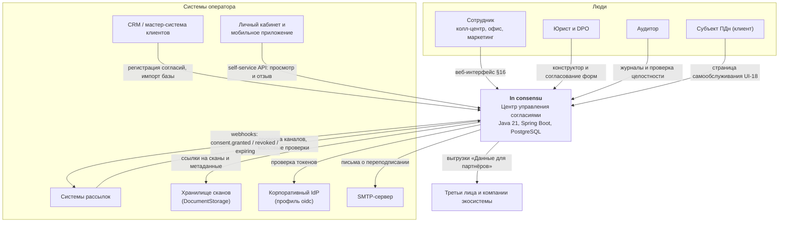
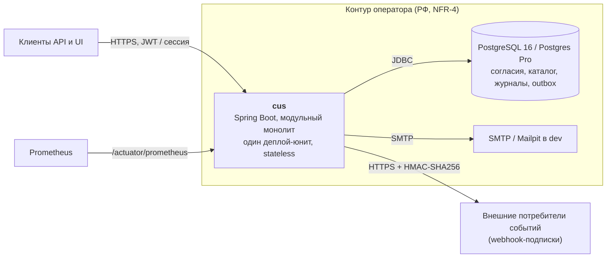
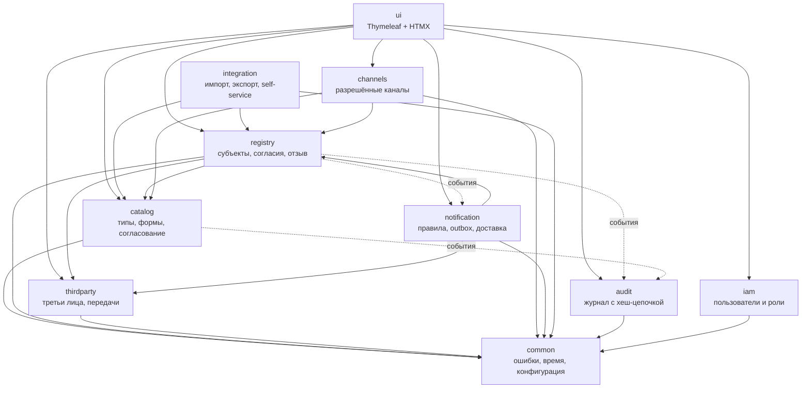
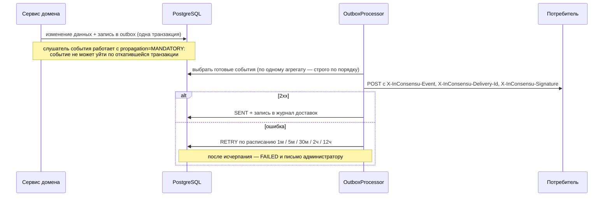
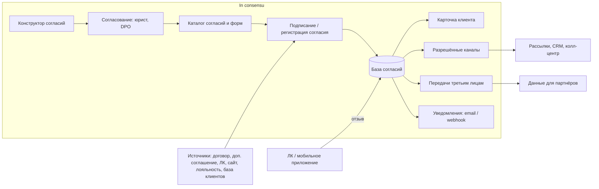

# Архитектура In consensu

Документ соответствует NFR-7 и описывает систему на уровнях C4 1–2. Детальные требования — в
[`TZ.md`](TZ.md), принятые решения — в [`DECISIONS.md`](DECISIONS.md).

## 1. Контекст (C4 уровень 1)

In consensu — внутренняя система оператора персональных данных. Она не рассылает сообщения и не хранит
клиентскую базу: она отвечает на вопрос «можно ли», доказывает наличие согласия и уведомляет
ответственных.

Границы работ — §3 ТЗ. Вне объёма: сами рассылки, CRM, мобильное приложение, УКЭП (интерфейс
`SignatureProvider` с заглушкой), хранилище сканов (интерфейс `DocumentStorage`), юридический аудит
текстов.

## 2. Контейнеры (C4 уровень 2)

Приложение горизонтально масштабируется (NFR-2): состояние живёт в PostgreSQL, фоновые задачи
защищены ShedLock, внешние эффекты идут только через транзакционный outbox.

## 3. Модули (C4 уровень 3, обзор)

Модульный монолит: один Maven-модуль, границы модулей — пакеты, правила проверяются ArchUnit (§5).

Правила (закреплены ArchUnit-тестами):

- слои внутри модуля: `api` → `application` → `domain`, инфраструктура подключается снаружи;
  `domain` не зависит от `api` и `infrastructure`;
- модули общаются только через application-сервисы и Spring `ApplicationEvent`;
- прямой доступ к репозиториям чужого модуля запрещён;
- DTO не используются как JPA-сущности; вывод только через slf4j.

## 4. Сквозные решения

| Тема | Решение | Где |
|---|---|---|
| Ошибки | RFC 9457 `ProblemDetail`, `type = urn:inconsensu:error:<code>`, поле `errors[]` | `common/error` |
| Корреляция | заголовок `X-Request-Id`, тот же идентификатор в MDC, логах и теле ошибки | `common/web` |
| Логи | JSON (structured logging Spring Boot), без ПДн (NFR-3) | `application.yml` |
| Время | в БД UTC, в API ISO-8601 с зоной, бизнес-даты в таймзоне оператора | `common/config` |
| Схема БД | Flyway, чистый SQL, `ddl-auto=validate`, миграции неизменяемы | `db/migration` |
| Фоновые задачи | `@Scheduled` + ShedLock (таблица в PostgreSQL) | этапы 3, 6 |
| Внешние эффекты | только через транзакционный outbox в одной транзакции с изменением данных | `notification/application` |
| Подпись событий | HMAC-SHA256 тела на секрете подписки, заголовок `X-InConsensu-Signature` | [`webhooks.md`](webhooks.md) |
| Шифрование контактов | AES-256-GCM под флагом `inconsensu.crypto.enabled`, поиск по HMAC | `common/application`, [`runbook.md`](runbook.md) |
| Хранение | архивация отозванных согласий, журналы остаются append-only | [`runbook.md`](runbook.md) |
| Фоновые запуски | задача ставится после коммита транзакции, а не внутри неё | `common/application/AfterCommitExecutor` |
| Наблюдаемость | Actuator health / prometheus, Micrometer | `common/config` |

### Доставка событий наружу (§8.6, FR-9.3)

Тело события формируется один раз, при записи в outbox: повтор обязан отправить тот же JSON, иначе
перестанут работать подпись и дедупликация у потребителя (ADR-0029). Персональных данных в теле нет —
только внешний идентификатор субъекта (NFR-3).

## 5. Потоки данных

Соответствует схеме продукта (§5 ТЗ):

## 6. Развёртывание

Один контейнер приложения + PostgreSQL. Поддерживаются Docker и Podman, Alt Linux (Альт Сервер),
PostgreSQL 15/16 и Postgres Pro Standard, OpenJDK 21 (Axiom JDK, Liberica). TLS терминируется на
периметре. Подробности эксплуатации — в `runbook.md` (этап 8).
